# **Flask-Authlib** 🔐

[](https://badge.fury.io/py/Flask-Authlib)

<hr>

Flask-Authlib - authentication library for Flask Web Framework.

Advantages:

- Templates: login, register
- Default `user` Model
- View Functions

# Install

By using `pip`:

```bash
$ pip install flask-authlib
```

# **Simple Usage**

> Username & Password-based authentication 🔑

- Import `Flask` from `flask`
- Import `SQLAlchemy` from `flask_sqlalchemy`
- Import `Auth` from `flask_authlib`

Code Sample:

```python
from flask import Flask
from flask_sqlalchemy import SQLAlchemy
from flask_authlib import Auth
```

Define your `app` and `db`. Create auth var from `Auth` class and call `init()` method:

```python
from flask import Flask
from flask_sqlalchemy import SQLAlchemy
from flask_authlib import Auth

app = Flask(__name__)
db = SQLAlchemy(app)

auth = Auth(app=app, db=db)
auth.init()

@app.route('/')
def home_page():
    return {'message': 'Hi, bro 😁'}
```

Run your backend:

```bash
$ export FLASK_APP=<app> && export FLASK_ENV=development
$ flask run --reload
```

**Screenshots:**

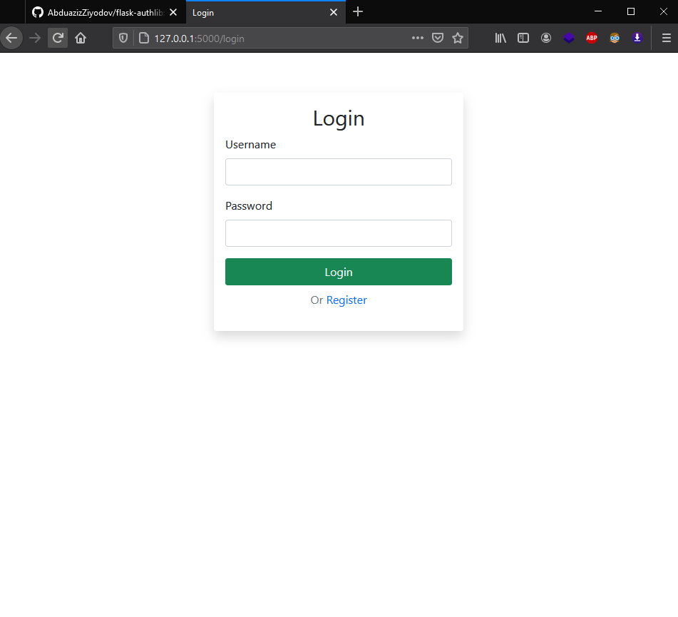
Login page at `/login`

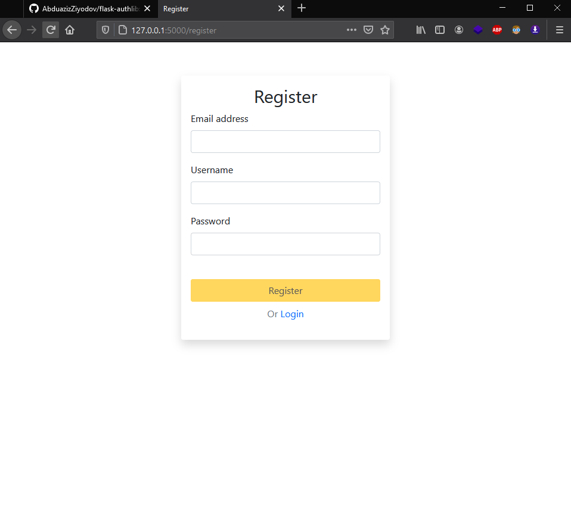
Register page at `/register`

# **Advanced Usage**

> You can change URLs

**Defaults**

- Home page - `/`
- Login page - `/login`
- Register page - `/register`
- Logout url - `/logout`

Write your URLs before calling the `init()` method:

```python
...

auth = Auth(app=app, db=db, login_url='/mylogin',
            register_url='/myreg', logout_url='/myexit',
            home_page='/')
auth.init()
...
```

> You can set your template config!

You can change:

- Button colour on forms
- Form title at login and register page
- All labels like Username.. email ...
- Text in button.

**Default template config**

```json

config = {
        "LOGIN_BTN": "btn-success",
        "REGISTER_BTN": "btn-warning",

        "LOGIN_BTN_TEXT": "Login",
        "REGISTER_BTN_TEXT": "Register",

        "LOGIN_PAGE_TITLE": "Login",
        "REGISTER_PAGE_TITLE": "Register",

        "LOGIN_LABEL_USERNAME": "Username",
        "LOGIN_LABEL_PASSWORD": "Password",
        "REGISTER_LABEL_USERNAME": "Username",
        "REGISTER_LABEL_PASSWORD": "Password",
        "REGISTER_LABEL_EMAIL": "Email address"
}
```

_p.s button colours based on bootstrap classes_

Setting your config:

```python
...
my_config = {
        "LOGIN_BTN": "btn-danger",
        "REGISTER_BTN": "btn-primary",

        "LOGIN_PAGE_TITLE": "Admin",
        "REGISTER_PAGE_TITLE": "Admin"
}
auth = Auth(app=app, db=db, template_config=my_config)
auth.init()
...
```

> If some settings are not entered, they remain as default

**Screenshots:**

> 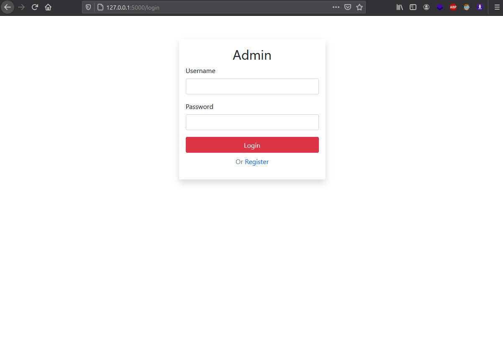
> Login page

<hr>

> 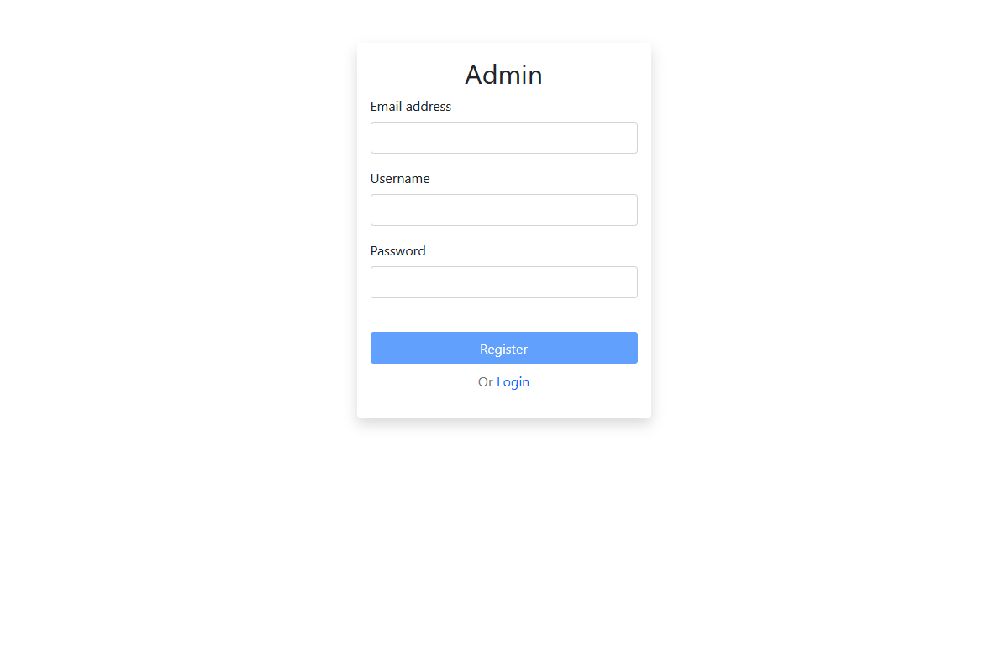
> Register page

# **JWT Usage**

> v1.3.1 - jwt token-based authentication 🔑

*Setup JWT authentication for your API with auth0!*

Example of code:

```python
from flask import Flask
from flask_authlib import JWT

app = Flask(__name__)
jwt = JWT(app=app, AUTH0_DOMAIN='*',API_AUDIENCE='*')


@app.route('/', methods=['GET'])
@jwt.required('read:data')
def home(token):
    return {"data": ['abduaziz', 'backend', 'programmer']}

```

- Import `JWT` from this library
- Define your app
- Create jwt var from JWT class and set some vars.
- **Params:**
- `AUTH0_DOMAIN`: your domain for auth0:
  > 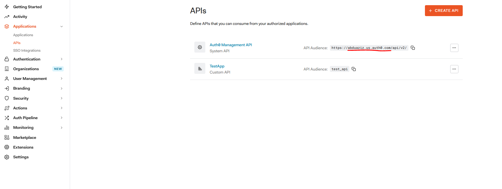
  > abduaziz.us.auth0.com
- `API_AUDINCE`: this is your API idenfication for auth0:
  > 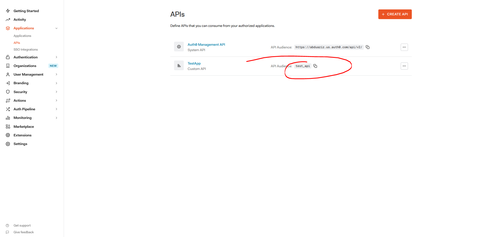
  > test_api

You have to create user permissions from your **API**:

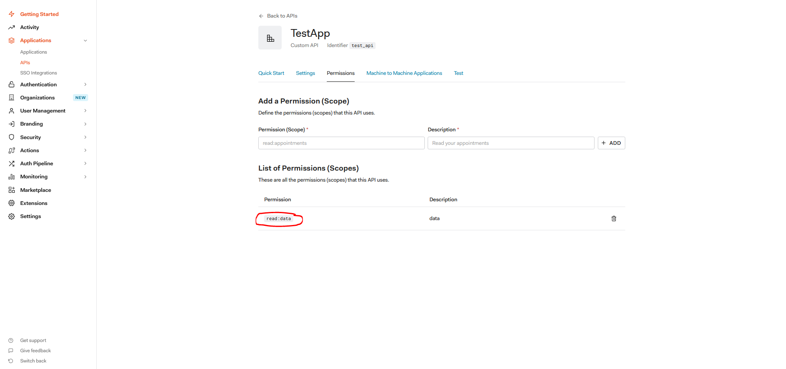

> `read:data` ~> permission

For testing, you should add a new user. Then, get the jwt token from the response:

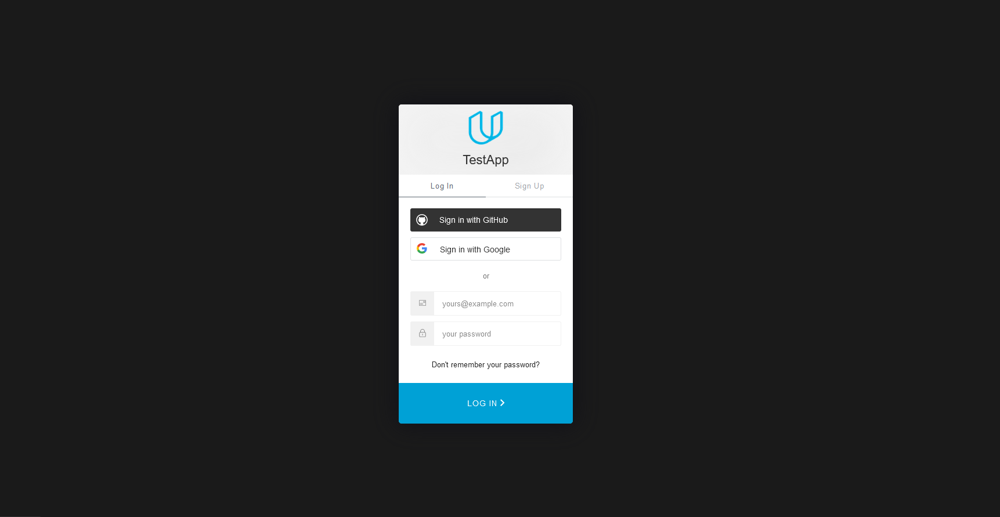

> **LOGIN_URI**:
>```
>https://{{AUTH0_DOMAIN}}/authorize?
>audience={{API_AUDINCE}}&>response_type=token&
>client_id={{CLIENT_ID}}&redirect_uri={>{REDIRECT_URI}}
>```


* `CLIENT_ID` - you can get it from your page of API.
* `REDIRECT_URI` - you can set it from API settings

After adding a new user, navigate the user management page and assign permissions to your user:

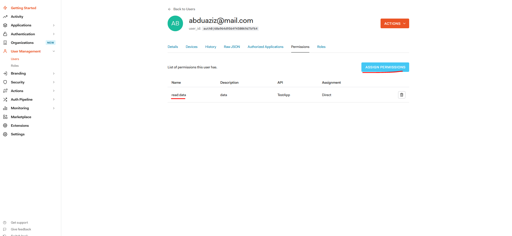

> **LOGOUT_URI**: `{AUTH0_DOMAIN}/logout`

Next, log in again and you will get a permission-based jwt token from HTTP response:

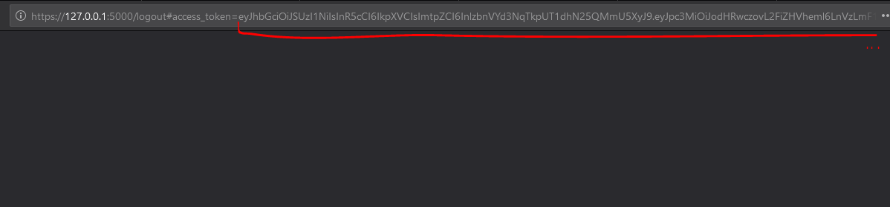
😁🎉

> p.s Check this jwt token from jwt.io

## **Test it !**

Application code:

```python
@app.route('/', methods=['GET'])
@jwt.required('read:data')
def home(token):
    return {"data": ['abduaziz', 'backend', 'programmer']}
```

> `@app.route(url_rule:str, methods:list)` - we should sent GET request to `/`

> `@jwt.required(permission: str)` - this is the protection of this API view. The user has to send a request with jwt token based on required permission. For this view, required `read: data` permission.

If the above requirements are met, the user will get the necessary information 😃


**Send request without jwt token🧐:**

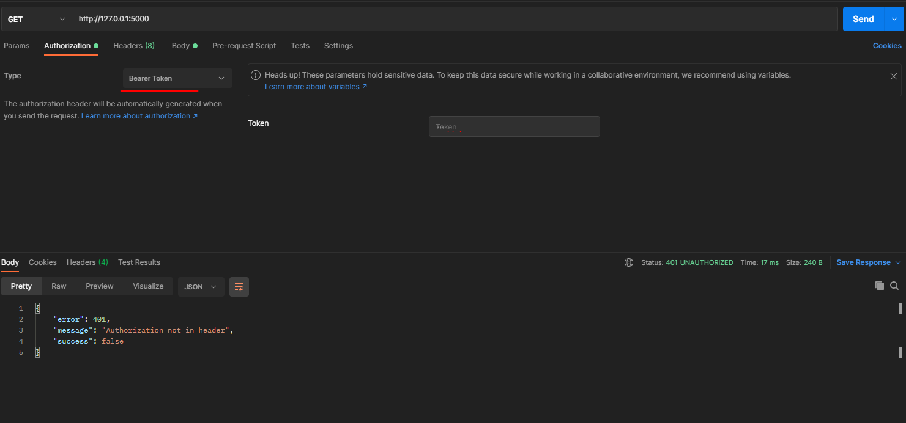
ok 🙂

**Send a request with jwt token😎:**

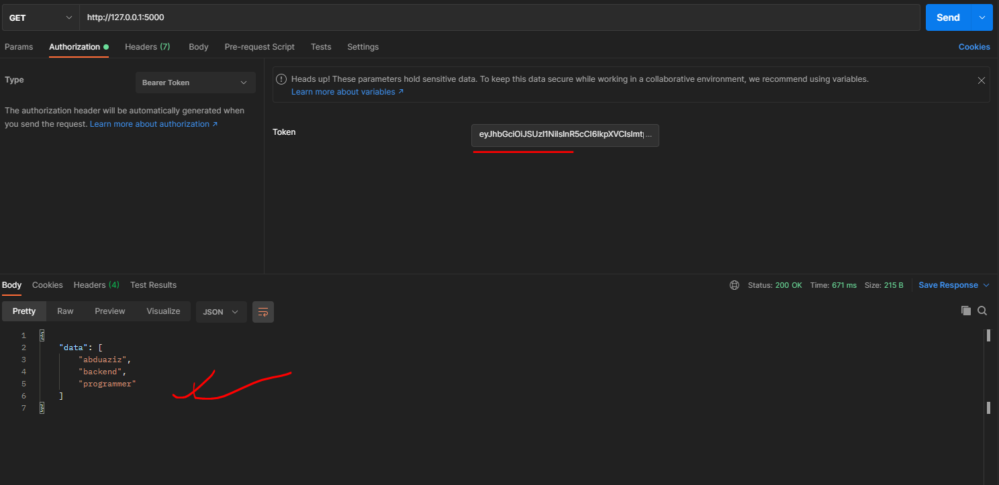
✅ Success, it works 🥳

Example of code for sending request:

```python
import requests

def send(url:str, token:str)->str:
    headers = {
      'Authorization': f'Bearer {token}'
    }
    response = requests.request("GET", url, headers=headers)

    return response.text

def main():
  url = input('url>')
  token = input('jwt>')
  print(send(url, token))

if __name__ == "__main__":
    main()
```

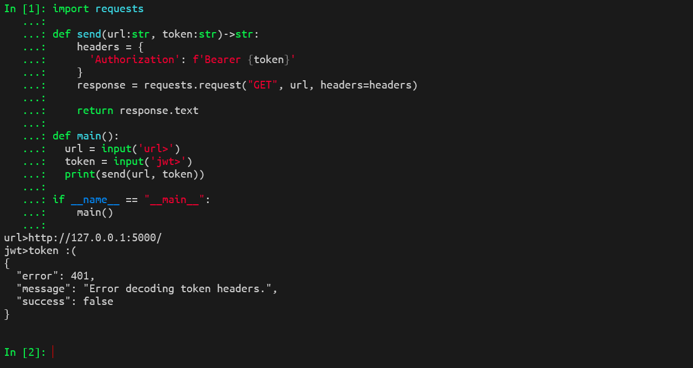


# **Running of Example** 🚀

## **First way**

> Required `docker`🐳

The project directory has:

- `Dockerfile`
- `docker-compose.yml`

For running this you have to type this command:

```bash
$ docker-compose up
```

Screenshot:

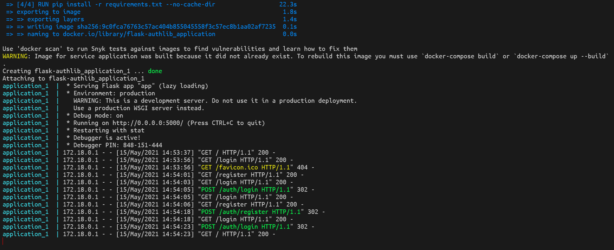

## **Second way**

Clone this repo:

```bash
$ git clone https://github.com/AbduazizZiyodov/flask-authlib.git
```

Navigate to `/example`:

```bash
$ cd example/
```

Install all required packages:

```bash
$ pip install -r requirements.txt
```

Run development server:

- `$ python app.py` or
- `$ gunicorn app:app` or
- `$ export FLASK_APP=app && flask run --reload`

Enjoy 😅


**Author: Abduaziz Ziyodov**
