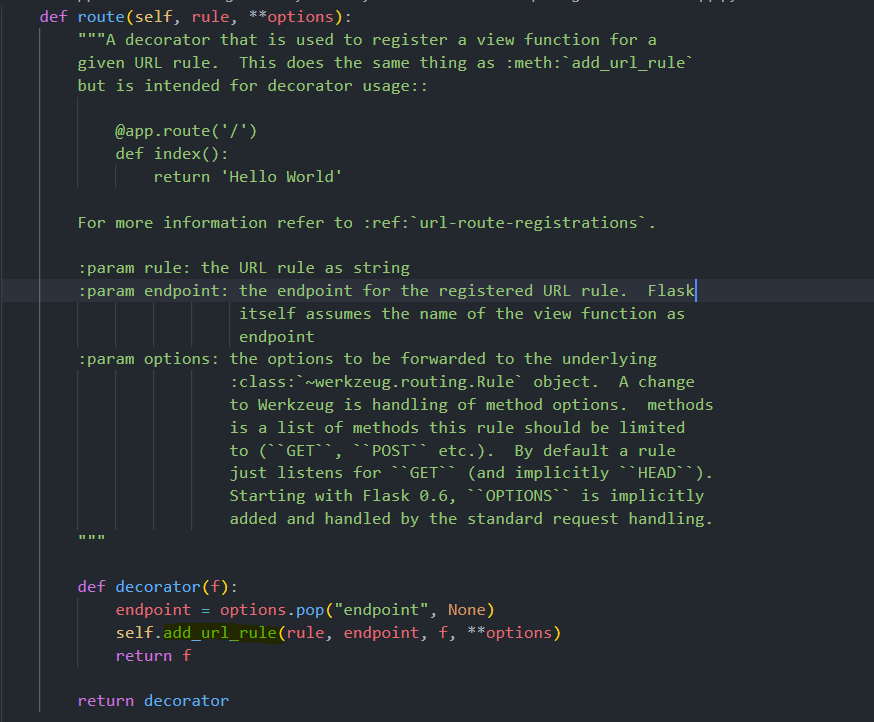

# Getting Started


<h4 style="text-align:center;">
    Flask is the best micro web framework written in Python 🔥
</h4>

!!! success "Installation"

    ```bash
    $ pip install -U flask
    ```

- [x] Open your favourite code editor 😍
- [x] Create a new `*.py` file ✅
- [x] Import `Flask` from the `flask` framework and define your app:

```python hl_lines="3"
from flask import Flask

app = Flask(__name__)
```

- `__name__` is the import name for our flask app

Create simple view function that returns simple `text/html` response:

```python hl_lines="7 8"
from flask import Flask


app = Flask(__name__)


def home_view():
    return "Hello Bro 👋"
```

Next, you will should add this view function on your app's url rules. For this, we have to use `Flask`'s `add_url_rule` method:

```python hl_lines="11-14"
from flask import Flask


app = Flask(__name__)


def home_view():
    return "Hello Bro 👋"


app.add_url_rule(
    rule="/",
    view_func=home_view
)
```

!!! info "`flask.Flask.add_url_rule`"

    *   `rule` should be `str`
    *  `view` should be function or class
    For class based views, `Flask` has `as_view` method.

!!! tip "Routes"

    The method of `add_url_rule` is used by flask developers very rarely. They use `route` decorator instead of using `add_url_rule` and it provides to assign URLs in our app to functions easily.


    ```python
    @app.route("/")
    def home_view():
        return "Hello Bro 👋"
    ```

    * `"/"` - url that our view function returns response.

    `route` decorator also uses from `add_url_rule` method :

    

    <p align="center">From flask's source code</p>

You can return any of the string and binary related types: `str`, `unicode` , `bytes` , `bytearray`, or if you prefer, you can return an already built `response` object:

```python
from flask import Response

app = Flask(__name__)

@app.route("/")
def function():
    return Response(...)
```

!!! warning "View Functions"

    The names we chose for our view functions should be unique.

    ```python
    @app.route("/")
    def home():
        return "Hello!"

    @app.route("/home")
    def home():
        return "Hello from home_2!"

    # AssertionError:
    # View function mapping is overwriting an existing endpoint function: :view_function_name:
    ```
