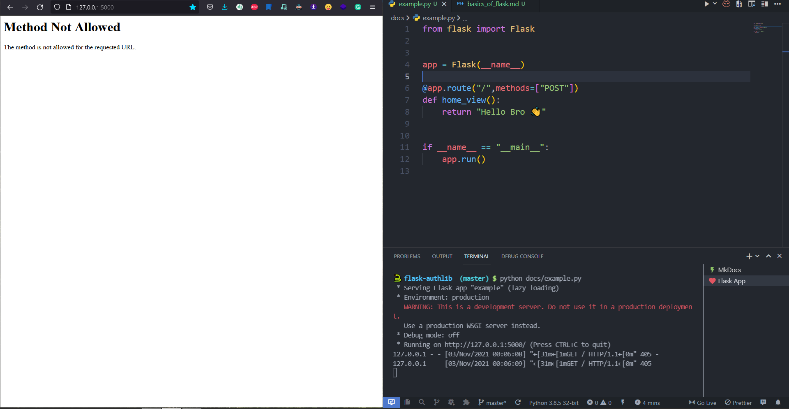

# HTTP methods

We can set specific HTTP methods to our routes. Add methods to the list that you want and give this methods list as route decorator's arguments with methods key ( `methods = [ ...]` ). For example, you want to allow only the **HTTP POST** method on your specific route, then you should add **POST** on methods like this:

```python hl_lines="1"
@app.route("/", methods=["POST"])
def home_view():
    return "Hello Bro 👋"
```

|                                       |
| :-------------------------------------------------------------------------: |
| ✅ Yeah, we sent a **GET** request from the browser, but it is not allowed. |
