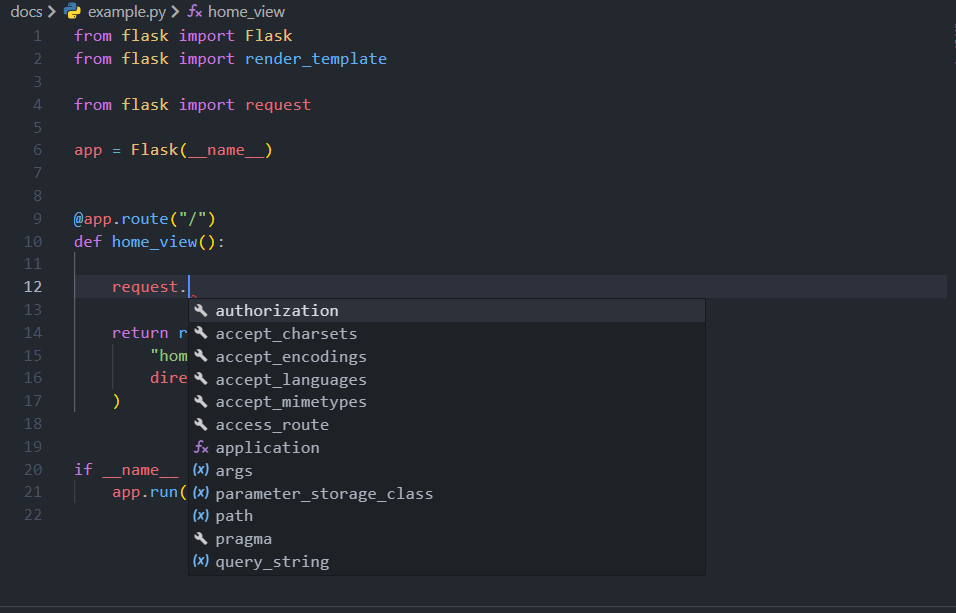
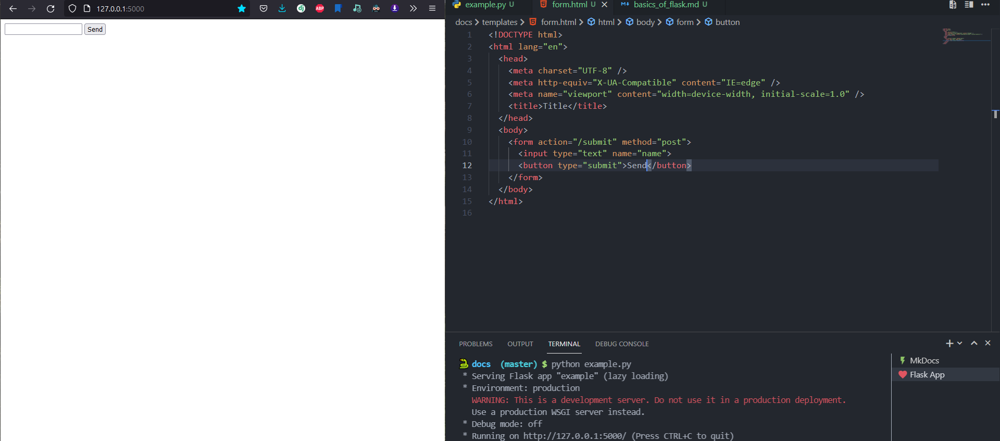
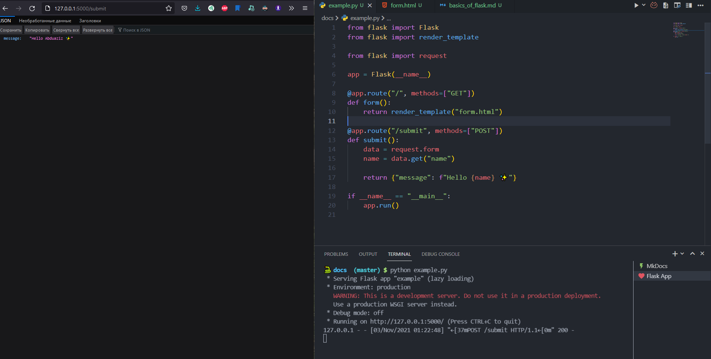

# Handling HTTP Requests

There is a flask's Request class that very helps to handle users' requests. You have to import just a `request` from `flask`.

```python
from flask import request
```

By writing `.` after `request` you will see all methods and attributes of the `request` object in your editor:



!!! success "flask.request"

    - `request.data` Contains the incoming request data as a string in case it came with a mime-type Flask does not handle.

    - `request.args` - the key/value pairs in the **URL** query string
    - `request.form` - the key/value pairs in the body, from a **HTML** post form, or **JavaScript** - request that isn't **JSON** encoded
    - `request.files` - the files in the body, which Flask keeps separate from form. **HTML** forms must use enctype=multipart/form-data or files will not be uploaded.
    - `request.values` - combined args and form, preferring args if keys overlap
    - `request.json` - parsed **JSON** data. The request must have the `application/json` content type, or use `request.get_json(force=True)` to ignore the content type.

    All of these are MultiDict instances (except for json). You can access values using:

    - `request.form['name']` - use indexing if you know the key exists
    - `request.form.get('name')` - use get if the key might not exist
    - `request.form.getlist('name')` - use getlist if the key is sent multiple times and you want a list of values. get only returns the first value.

    📃 [StackOverflow](https://stackoverflow.com/questions/10434599/get-the-data-received-in-a-flask-request)

Let's try this!

- [x] Create `form.html` on your `templates/` dir
- [x] Create one view function that returns only HTML form.
- [x] Then, we will create a view function for handling simple **POST** requests.

```html hl_lines="12"
<!-- form.html -->
<!DOCTYPE html>
<html lang="en">
  <head>
    <meta charset="UTF-8" />
    <meta http-equiv="X-UA-Compatible" content="IE=edge" />
    <meta name="viewport" content="width=device-width, initial-scale=1.0" />
    <title>Title</title>
  </head>
  <body>
    <form action="/submit" method="post">
      <input type="text" name="name" />
      <button type="submit">Send</button>
    </form>
  </body>
</html>
```

> - `action` - endpoint that we want to send request
> - `method` - We will use **HTTP POST** for sending something.

```python hl_lines="12 15 16"
from flask import Flask
from flask import render_template

from flask import request


app = Flask(__name__)

@app.route("/", methods=["GET"])
def form():
    return render_template("form.html")

@app.route("/submit", methods=["POST"])
def submit():
    data = request.form # get request form data
    name = data.get("name") # get name's value from this form

    return {"message": f"Hello {name} ✨"} # return something

if __name__ == "__main__":
    app.run()
```

> Only HTTP `POST` methods are allowed in the `submit` view.

|   |
| :---------------------------------------------------------------------------: |
|                                 It works 😁🎉                                 |

!!! success "This is the end of our simple flask basics tutorial 😊"