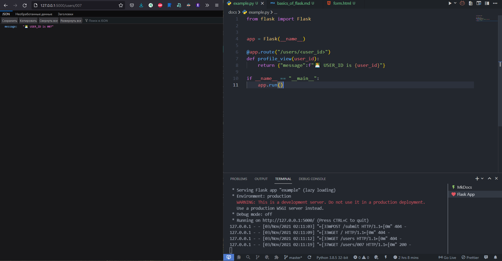

# Routing

The route that we wrote in the previous tutorial, is **Static Route**.
If we want to create a profile page for our users, our web service should generate URLs of their profiles dynamically. We cannot solve this by using static routes. We have to create dynamic routes (variable rules ...)

Simple logic for profile page:

```python
# users/:user_id

def profile_view(user_id):
    # logic ...
```

For these dynamic routes, we should write the dynamic URL rules like this:

```python hl_lines="6-7"
from flask import Flask


app = Flask(__name__)

@app.route("/users/<user_id>")
def profile_view(user_id):
    return {"message":f"👨‍💻 USER_ID is {user_id}"}

if __name__ == "__main__":
    app.run()
```

By defining our URL rule within `< ... >`, it indicates a variable. They can be type-checked by adding a colon(`:`). There are data types that routes can accept:

!!! info "Variable Rules"

    - `string` - (default) accepts any text without a slash
    - `int` - accepts positive integers
    - `float` - accepts positive floating point values
    - `path` - like string but also accepts slashes
    - `uuid` -accepts UUID strings

    Variable Rules should be given as the view function's argument.



!!! tip "ProTips"

    - You can handle multiple routes with a single function by simply stacking additional route decorators above any route!
        ```python hl_lines="1-3"
        @app.route("/")
        @app.route("/home")
        @app.route("/something")
        def home():
            return "Hello Bro 👋"
        ```
