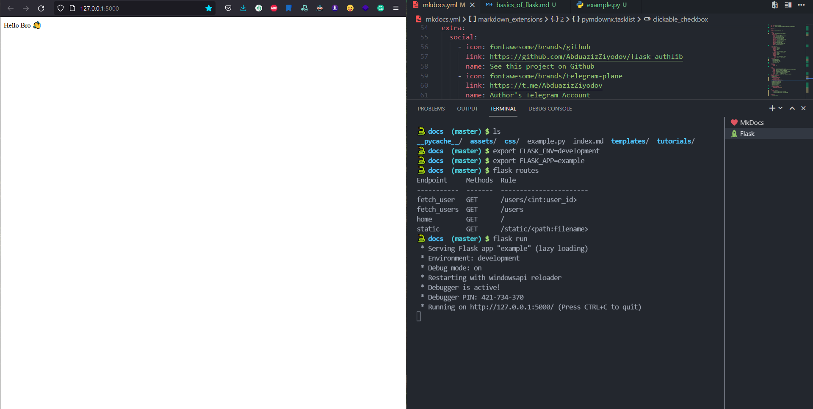

# Running Application

For running this application, we can use `Flask`'s `run` method. But we should write this line of code on `if __name__ == "__main__"` statement. Why ?!

!!! info "`if "__name__" == "__main__"` ?"

    **Short Answer**: this is the part that runs when the script is run from the CLI.

    * [freeCodeCamp](https://www.freecodecamp.org/news/if-name-main-python-example)
    * [StackOverflow](https://stackoverflow.com/questions/419163/what-does-if-name-main-do)

```python
# ...

if __name__ == "__main__":
    app.run()
```

!!! quote "Development Server"

    *Do not use `run()` in a production setting. It is not intended to meet security and performance requirements for a production server. Instead, see deployment for **WSGI** server recommendations ...*

    ```python
    # read from here 👇
    >>> Flask.run.__doc__
    ```

```bash
$ python <my_module>.py
```


## **Another ways of running Flask app**

**Running from terminal**:

```bash
$ export FLASK_APP=<module_name>
$ flask run
```

- `module_name` - if your file's name is `server.py`, you should write `server`
- `flask run` - flask has its built-in `CLI` 🔥
- Reference: [Flask CLI](https://flask.palletsprojects.com/en/2.0.x/cli)

You can set environments for your flask apps. If the environment is set to `development`, the flask command will enable **debug** mode and flask run will enable the interactive **debugger** and **reloader**.

```bash
$ export FLASK_ENV=development
$ export FLASK_APP=<module_name>
$ flask run
```

You do this in your code by passing `debug=True` in the `run` method:

```python
app.run(debug=True)
```



## **Gunicorn 🦄**


!!! info "Gunicorn"

    **Gunicorn** is a WSGI HTTP server for **UNIX** 🐧 You cannot use `gunicorn` server on your windows. But you will be able to run your applications by gunicorn using `docker` containers or `WSL` (windows subsystem for Linux)

!!! success "Installation"

    ```bash
    $ pip install gunicorn
    ```

Running application:

```bash
$ gunicorn -w <workers> <your_module>:<your_app>
```

- `workers` - it is good that settings workers number by this formula: `workers = CPU_CORE * 2 + 1`
- `your_module` - if you wrote flask app's code in `file.py`, you should write `file`
- `your_app` - if you defined your flask app as `app` in file.py`, you should write `app`

```bash
$ gunicorn -w 9 file:app
```

