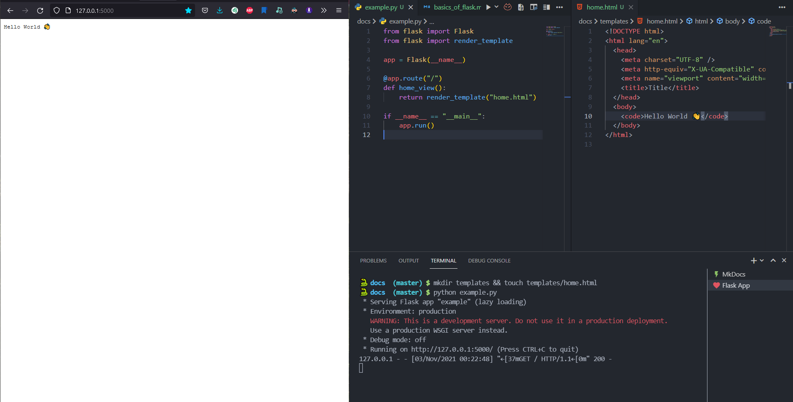

# Templates


<p align='center'>
    Jinja is a fast, expressive, extensible templating engine!
</p>

!!! success "Installation"

    Jinja is already installed if you are installed flask 😀

Flask uses the `Jinja` template engine for rendering **HTML** files. By defining your `Flask` application, it sets the default path of templates dir ( it is templates/` ).

- [*] Import `render_template` function from `flask` on your code.
- [*] Create `templates/` directory and any `*.html` file.

!!! question "Rendering Templates"

    Give your template's name as an argument to the `render_template` function.

```python hl_lines="2 8"
from flask import Flask
from flask import render_template

app = Flask(__name__)

@app.route("/")
def home_view():
    return render_template("home.html")

if __name__ == "__main__":
    app.run()
```

|  |
| :------------------------------------: |
|              It works 👀               |

We can also pass variables from our python code to our templates.

```python hl_lines="11"
from flask import Flask
from flask import render_template

app = Flask(__name__)


@app.route("/")
def home_view():
    return render_template(
        "home.html",
        directory=app.template_folder
    )


if __name__ == "__main__":
    app.run()
```

You should write(use) passed variable in your template between curly braces:

```html hl_lines="11"
<!DOCTYPE html>
<html lang="en">
  <head>
    <meta charset="UTF-8" />
    <meta http-equiv="X-UA-Compatible" content="IE=edge" />
    <meta name="viewport" content="width=device-width, initial-scale=1.0" />
    <title>Title</title>
  </head>
  <body>
    <code>Hello World 👋</code>
    <h2>TEMPLATES_DIR: {{ directory }}</h2>
  </body>
</html>
```

!!! info "Variables"

    - `directory` - the name of our variable that we want to pass.
    -  `app.template_folder` - flask app's default template dir.


