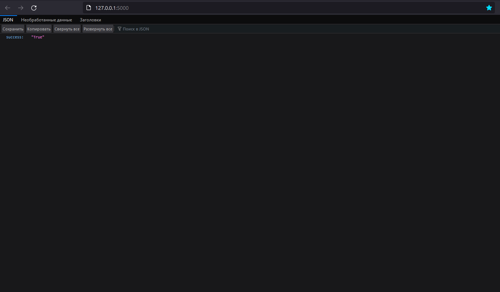

# 🚀 Flask

!!! info "About"
    **Flask** - One Of The Best Python Web Frameworks!

!!! success "Install flask"
    By using `pip`

    ```bash
    $ pip install -U flask
    ```

Import `Flask` from `flask` framework and define your app:

```python
from flask import Flask

app = Flask(__name__)
```

- `__name__` is import name for our flask app

Create simple view function that returns simple `JSON` response:

```python
from flask import Flask

app = Flask(__name__)

def home_view():
    return {"success":"True"}
```

Next, you will have to add this view function on your app's url rules. For this, we have to use `Flask`'s `add_url_rule` method:

```python
from flask import Flask

app = Flask(__name__)

def home_view():
    return {"success":"True"}

app.add_url_rule(
    rule="/",
    view_func=home_view
)
```

!!! info "Flask.add_url_rule( ... )"

    *   `rule` should be `str`
    *  `view` should be function or class
    For class based views, `Flask` has `as_view` method.

For running this application, we can use `Flask`'s `run` method. But we should write this line of code on `if **name** == "**main**" statement. By why?

!!! info "if **name** == "**main**" ?"
    **Short Answer**: this is the part that runs when the script is run from the CLI.

    * [freeCodeCamp](https://www.freecodecamp.org/news/if-name-main-python-example)
    * [StackOverflow](https://stackoverflow.com/questions/419163/what-does-if-name-main-do)

```python
# ...

if __name__ == "__main__":
    app.run()
```

!!! quote "About run()"

    *Do not use `run()` in a production setting. It is not intended to meet security and performance requirements for a production server. Instead, see deployment for **WSGI** server recommendations ...*

    ```python
    # 👇
    Flask.run.__doc__
    ```

```bash
$ python <file_name>.py
```




!!! tip "Routes"
    Another way of adding routes on your flask application is using from `Flask`'s `route` decorator:

    ```python
    @app.route("/")
    def home_view():
        return {"success":"True"}
    ```

    * `"/"` - url that our view function returns its response.

We can set specefic http method on our routes. For this, we have to give list of http methods that we want to `Flask`'s `route` method:

```python
@app.route("/",methods=["GET","POST"])
def home_view():
    pass
```

For this route, our users are allowed to send requests with only `GET` or `POST` methods.

* `methods` should be `list`