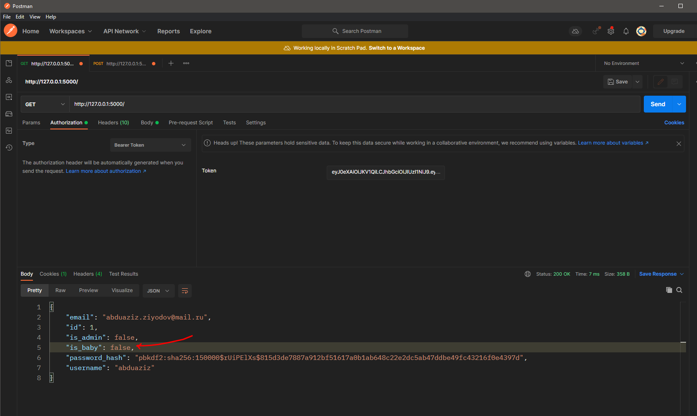

# **Custom User Model**

!!! info "Note"

    **Flask Authlib** uses SQLAlchemy ORM on the database part. That means if you want to set your user model you should also use `SQLAlchemy`.

### **Default User Model**

Code from `flask_authlib.database.models.User`:

```python
class User(db.Model, UserMixin):
    __tablename__ = table_name
    __table_args__ = {'extend_existing': True}

    id = db.Column(db.Integer, primary_key=True)
    username = db.Column(db.String, nullable=False)
    email = db.Column(db.String, nullable=False)
    password_hash = db.Column(db.String, nullable=False)
    admin = db.Column(db.Boolean, default=False)

    def is_admin(self) -> bool:
        return self.admin

    def insert(self) -> None:
        db.session.add(self)
        db.session.commit()

    def to_dict(self):
        columns: list[str] = self.__table__.columns.keys()

        return {
            key: getattr(self, key)
            for key in columns
        }
```

### **Default User Schema(Pydantic)**

Code from `flask_authlib.schemas.User`:

```python
class User(BaseModel):
    id: Optional[int]
    username: str
    email: EmailStr
    password_hash: str
    is_admin: bool
```

### **User Model**

For customization database model, you should get the default user model and create your user model class based on the default user model:

Getting default user model:

```python
from flask_authlib import get_user_model as DefaultUserModel
```

Create your user model. For example, I want to add the `is_baby` column on my user model:

> Make sure that you have created your flask app and database(DB). Don't forget about `SQLALCHEMY_DATABASE_URI`.

```python hl_lines="3"
from flask_authlib import get_user_model as DefaultUserModel

class CustomUser(DefaultUserModel(db, "users")):
    is_baby = db.Column(db.Boolean, default=False)
```

> `db` and `table_name` arguments are required for `get_user_model`

Next, you have to apply this user model.

**Code**

```python hl_lines="16"
from flask import Flask
from flask_sqlalchemy import SQLAlchemy

from flask_authlib import JWT
from flask_authlib import get_user_model as DefaultUserModel

app = Flask(__name__)
db = SQLAlchemy(app)


class CustomUser(DefaultUserModel(db, "users")):
    is_baby = db.Column(db.Boolean, default=False)

app.config["SQLALCHEMY_DATABASE_URI"] = "sqlite:///database.sqlite"

auth = JWT(app, db, UserModel=CustomUser)

app.add_url_rule(rule="/", view_func=lambda: "Hello World!")

app.run()
```

### **User Schema**

If we use our modified model on this library, in the authentication process `pydantic` simply ignores new fields of our model. 
But why ?! We have changed `user model`, not `user schema`. Pydantic serializes data according to its schemas. We changed the user model, and now we must change the user schema.

Get default user schema:

```python
from flask_authlib import User
```

Create your pydantic schema based on this `User`:

```python hl_lines="3"
from typing import Optional

class UserSchema(User):
    is_baby:Optional[bool]
```

We have included our new field on this schema.
Change default user schema from `JwtConfig`. For this, you should create your settings class.

```python hl_lines="3"
from flask_authlib import JwtConfig

class MyConfig(JwtConfig):
    user_schema:User = UserSchema
```

Apply your settings:

```python
auth = JWT(app,db,UserModel=CustomUser,settings=MyConfig)
```

Run and test it!

**Code**:

```python
from typing import Optional

from flask import Flask
from flask_sqlalchemy import SQLAlchemy

from flask_authlib import User
from flask_authlib import JWT
from flask_authlib import JwtConfig
from flask_authlib import get_user_model as DefaultUserModel

app = Flask(__name__)
db = SQLAlchemy(app)

app.config["SQLALCHEMY_DATABASE_URI"] = "sqlite:///database.sqlite"


class CustomUser(DefaultUserModel(db, "users")):
    is_baby = db.Column(db.Boolean, default=False)


class UserSchema(User):
    is_baby: Optional[bool]


class MyConfig(JwtConfig):
    user_schema: User = UserSchema


auth = JWT(app, db, UserModel=CustomUser, settings=MyConfig)

@app.route("/")
@auth.jwt_required
def home(user:UserSchema):
    return user.dict()

app.run()
```



👍
