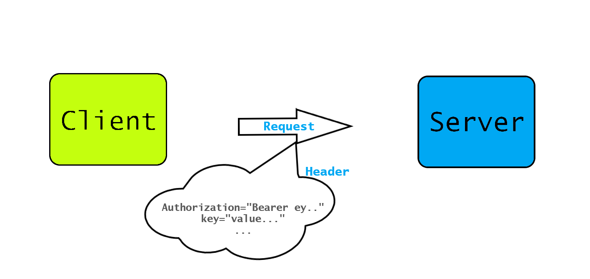

> 

### **💡 JWT**

JSON Web Token (**JWT**) is an open standard (`RFC 7519`) that defines a compact and self-contained way for securely transmitting information between parties as a `JSON` object. This information can be verified and trusted because it is digitally signed. JWTs can be signed using a secret (with the `HMAC` algorithm) or a public/private key pair using RSA or ECDSA.

Although **JWTs** can be encrypted to also provide secrecy between parties, we will focus on signed tokens. Signed tokens can verify the integrity of the claims contained within them, while encrypted tokens hide those claims from other parties. When tokens are signed using `public/private key pairs, the signature also certifies that only the party holding the private key is the one that signed it.

> [Reference](https://jwt.io/introduction)

### **🤔 What is the JSON Web Token structure?**

In its compact form, JSON Web Tokens consist of three parts separated by dots (.), which are:

- [x] Header
- [x] Payload
- [x] Signature

Therefore, a **JWT** typically looks like the following:

```
xxxxx.yyyyy.zzzzz
```

> Joke: If you see that token starts with `ey`, you can say that it is a **JWT** token 😂

### **✨ How do JSON Web Tokens work?**

> A very common use for JWT — and perhaps the only good one — is as an API authentication mechanism.

Whenever the user wants to access a protected route or resource, the user agent should send the JWT, typically in the Authorization header using the Bearer schema. The content of the header should look like the following:

> 

By using python's `requests` library:

```python
import requests

jwt_token:str = "ey..."
url = "http://my-host.com/api/login"
request_body = {"username":"Abduaziz"}

headers = {"Authorization": f"Bearer {jwt_token}"}

response = requests.request(
    "POST",
    url,
    headers=headers,
    data=request_body
)

print(response.text)
```

When we send this request, the server:

- [x] Tries to get `Authorization` from `HTTP` header.
- [x] Decodes and checks the validity of this token.
- [x] If there are errors with the token the server returns the `HTTP 401` response to the client.
- [x] JWT tokens have an expiration time. If the token has expired, users can't use it. If not, the server returns a successful response.

### **✅ Permissions**

> 

We can place user `role` & `permissions` (admin, user ...) on the JWT token. You can't access to `admin` resource when you send a valid JWT token that has `user` permission, not `admin`.

Adding permissions to JWT can be done on the token `encoding` process. You should add permissions on the JWT token's payload. After that, by decoding this token you can get this payload.

Example

```JSON
{
  "sub": "1234567890",
  "name": "John Doe",
  "admin": true
}
```

!!! info "Libraries"

    Reference to the libraries that help you work with **JWT**: [https://jwt.io/libraries](https://jwt.io/libraries)
