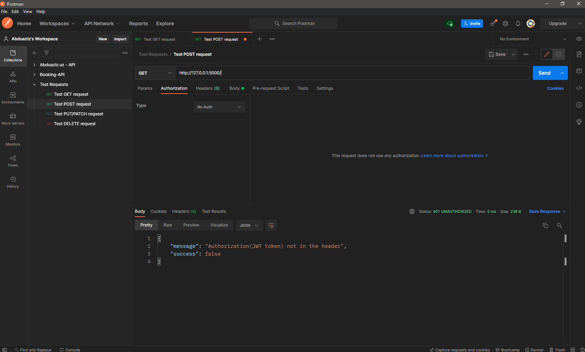
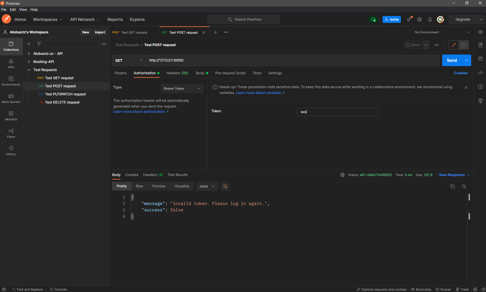
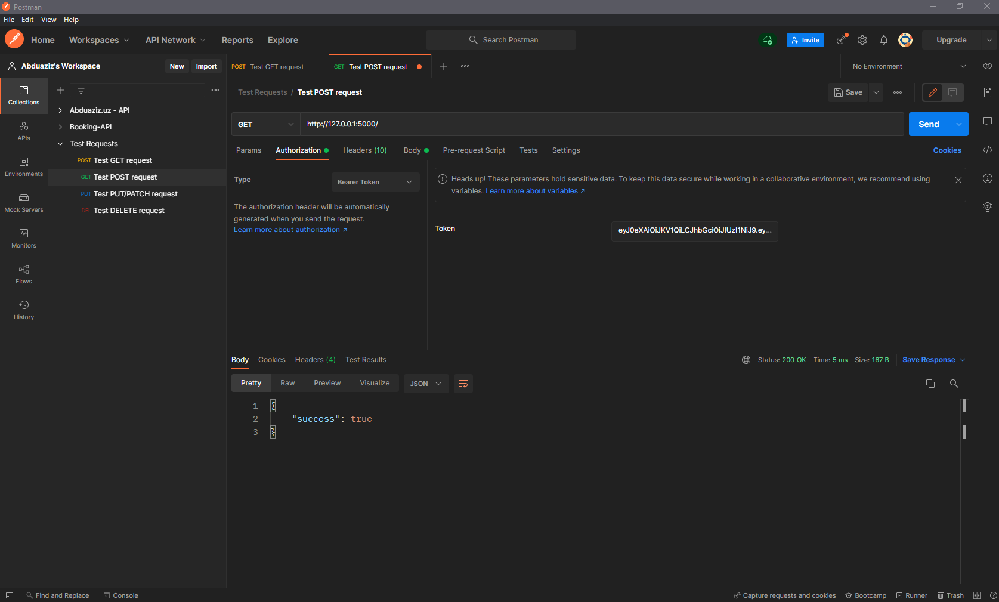
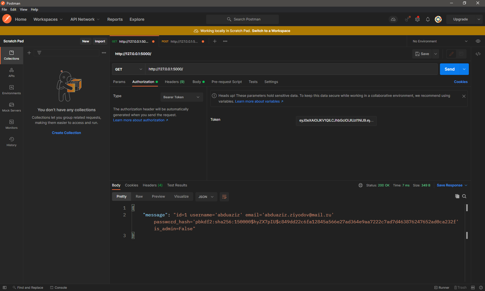
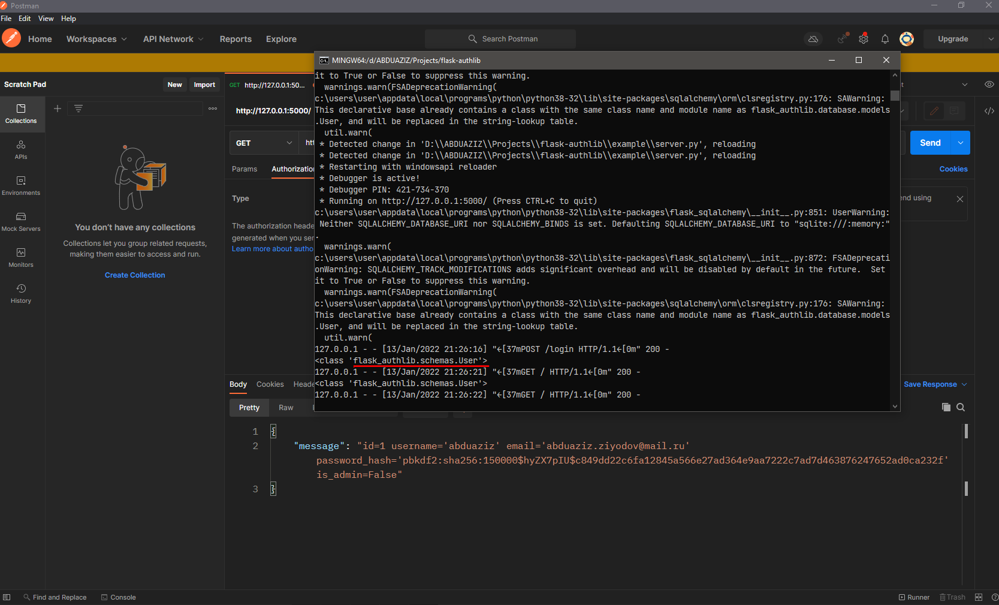
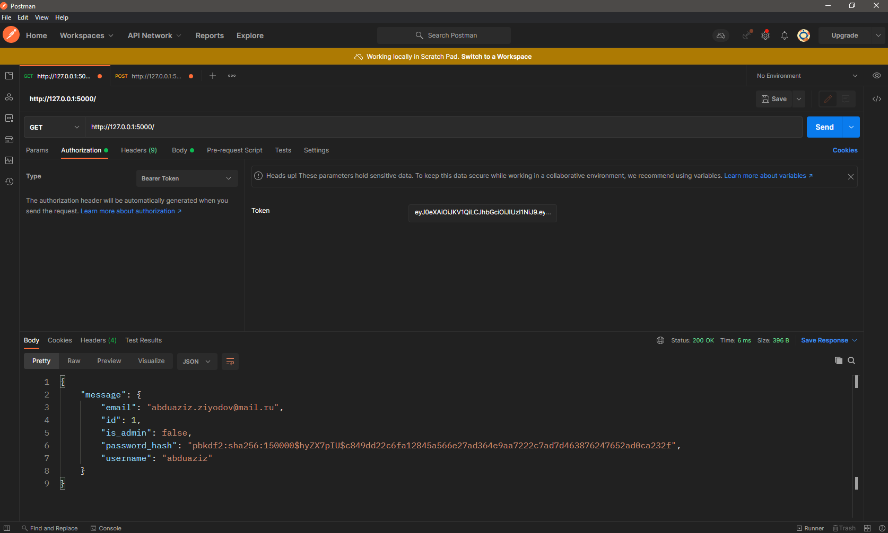
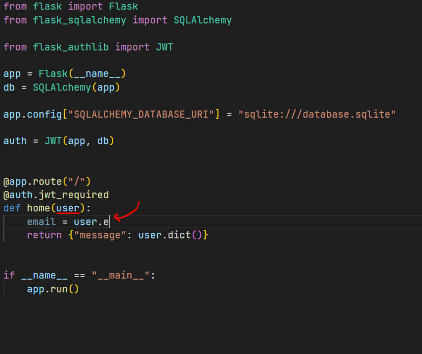
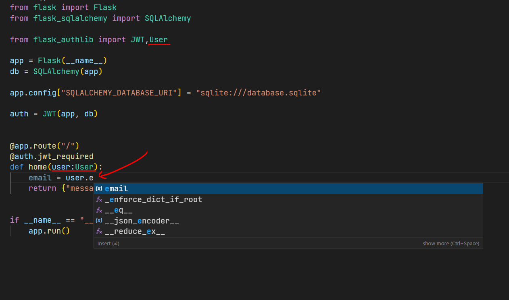

# **Advanced usage of JWT**

### **🔐 Protecting Routes**

For protecting your API routes with JWT tokens you should use the `jwt_required` decorator on your view functions. It can handle any exceptions automatically.

Basic application:

```python hl_lines="4 11"
from flask import Flask
from flask_sqlalchemy import SQLAlchemy

from flask_authlib import JWT

app = Flask(__name__)
db = SQLAlchemy(app)

app.config["SQLALCHEMY_DATABASE_URI"] = "sqlite:///database.sqlite"

auth = JWT(app, db)

@app.route("/")
def home():
    return {"success":True}


if __name__ == "__main__":
    app.run()
```

Using `flask_authlib.JWT.jwt_required`:

```python hl_lines="6"

# ....

auth = JWT(app, db)

@app.route("/")
@auth.jwt_required
def home():
    return {"success":True}

# ...

```

### **🧪Testing**

**1)** The response should have `401` status

- [x] We have not included the JWT token in your HTTP request header



**2)** The response should have `401` status

- [x] We sent an invalid JWT token.



**2)** The response should have a `200` status

- [x] Our JWT token is valid.



> It works, why😂?

### **🧑 Get current user from JWT**

Another feature of this library is that you can easily get the user's credentials after the decoding process. You have to use the `jwt_required` decorator for protecting your API endpoint via JWT tokens. After that, if you want to get `current_user` from JWT, you should pass only one function argument with the name `user`.

```python hl_lines="16"
from flask import Flask
from flask_sqlalchemy import SQLAlchemy

from flask_authlib import JWT

app = Flask(__name__)
db = SQLAlchemy(app)

app.config["SQLALCHEMY_DATABASE_URI"] = "sqlite:///database.sqlite"

auth = JWT(app, db)


@app.route("/")
@auth.jwt_required
def home(user):
    return {"message": str(user)}

if __name__ == "__main__":
app.run()
```

Send `GET` request to our basic route:



Bro, we have got something 👀 You can see user's info is included in the JWT token. You need not write a parser for serializing user info. We used `str(user)` above for not getting any exceptions related to response data type. You can use python's super, hyper debugger for getting the type of this data. This is the `print`.

Just use print and type in your code like this:

```python hl_lines="5"
...
@app.route("/")
@auth.jwt_required
def home(user):
    print(type(user))
    return {"message": str(user)}
...
```

Send `GET` request and look at your terminal:



`flask_authlib.schemas.User` is pydantic model which is used for validating & serializing user credentials. You can use pydantic's features in your code.

One of these features is `dict` method. This is not `dict` object on python, it is one of the useful methods of `pydantic.BaseModel`.

!!! info "BaseModel.dict"

    Generate a dictionary representation of the model, optionally specifying which fields to include or exclude.

Let's use it for converting our user credentials to python's dict object:

```python hl_lines="5"
...
@app.route("/")
@auth.jwt_required
def home(user):
    return {"message": user.dict()}
...
```



Yeah 😉

!!! tip "Type Annotations"

    Another feature of pydantic is that you can use your pydantic models as type annotations. It is supported by many `IDEs` (I use vscode).

    For instance:

    

    We can't see any suggestions. Because we don't know the type of this function argument. For solving this task, we can use type annotations (we can use them everywhere).

    ```python hl_lines="2 5"
    # Defining Variable
    response:ResponseModel = client.post(**kwargs)

    # Function and class methods' arguments
    def do_it(self,data:dict) ->List[str]: # `data` is `dict` object 🙂
        return list(self.just_do_it(data))

    ```

    Use `flask_authlib`'s User model for annotating types on your code:

    

    **Code**

    ```python hl_lines="1 5 6"
    from flask_authlib import JWT,User
    ...
    @app.route("/")
    @auth.jwt_required
    def home(user:User):
        email = user.email
        return {"message": user.dict()}
    ...
    ```
