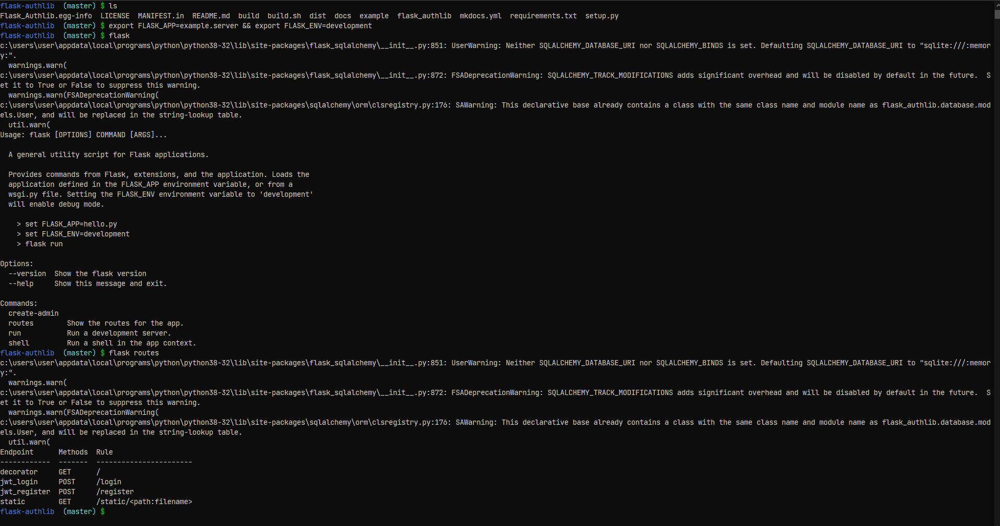
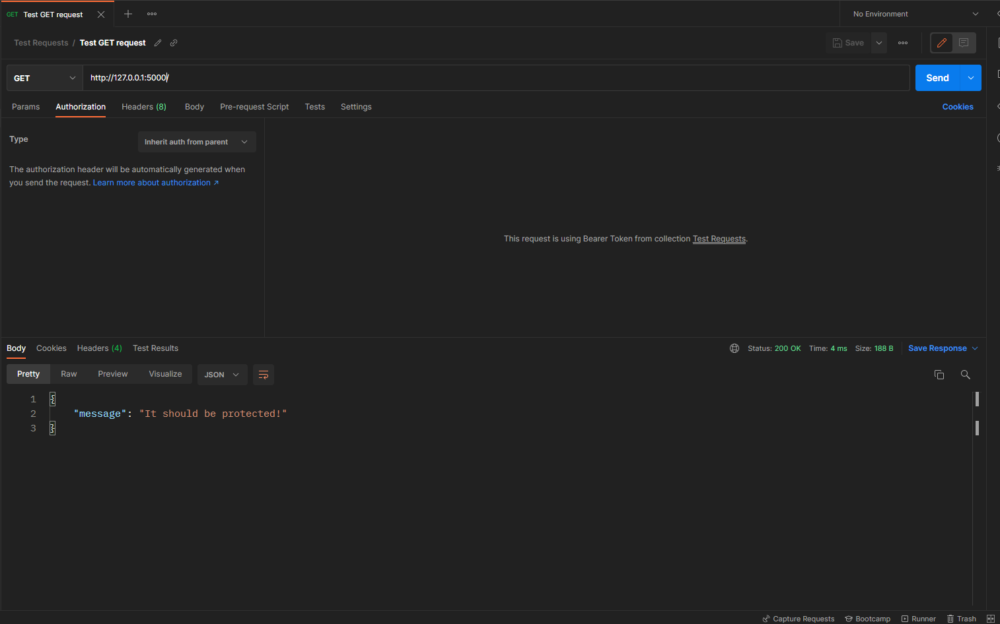
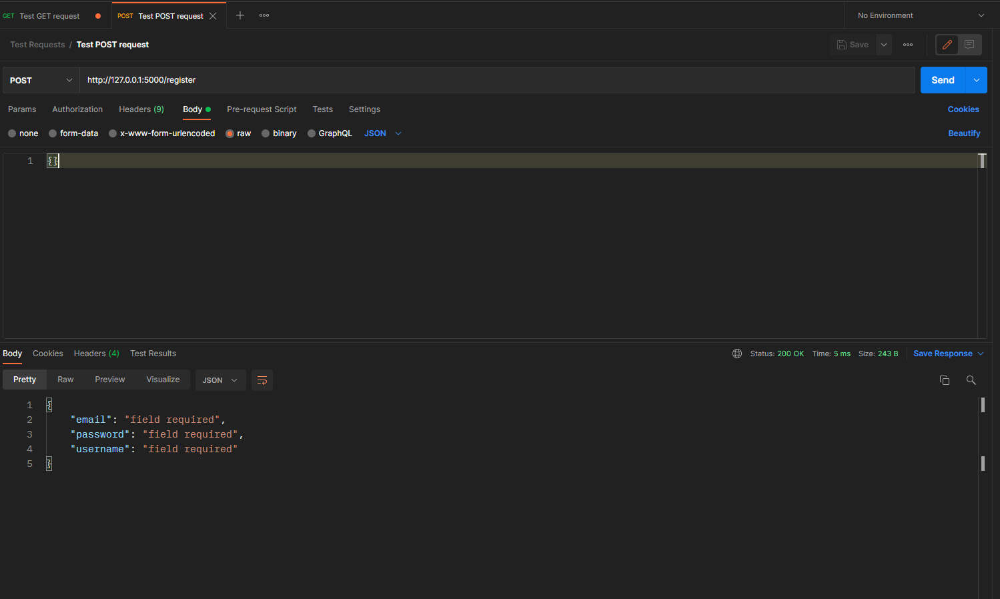
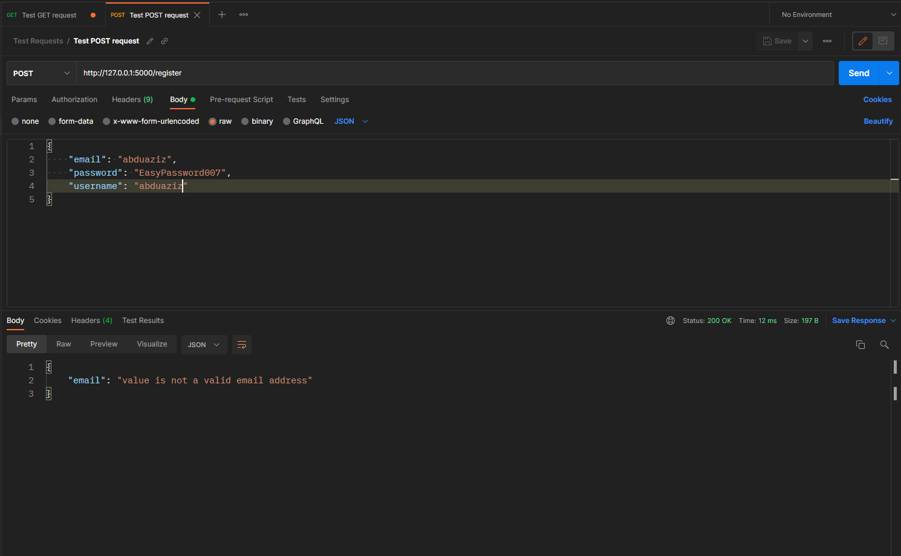
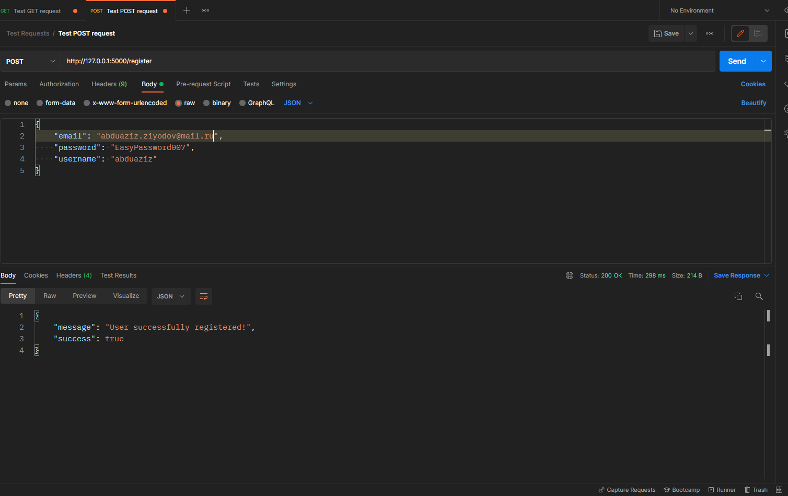
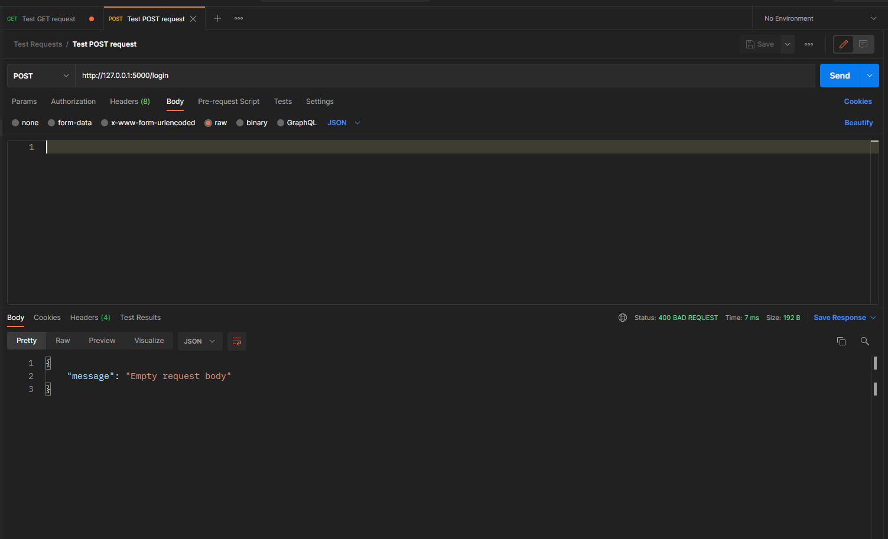
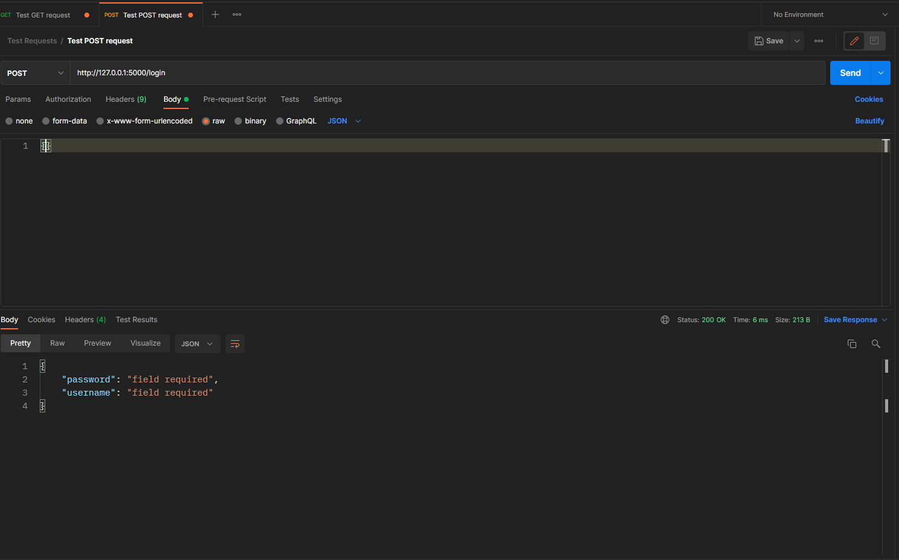
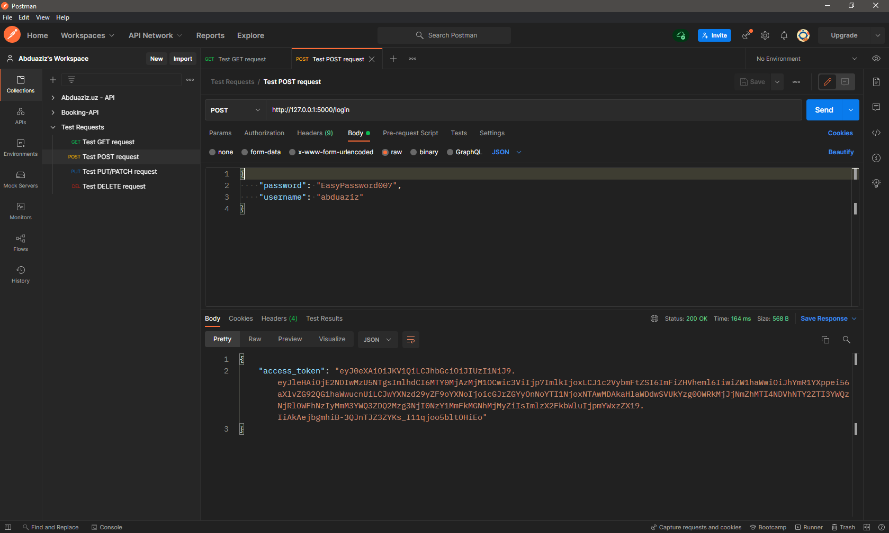
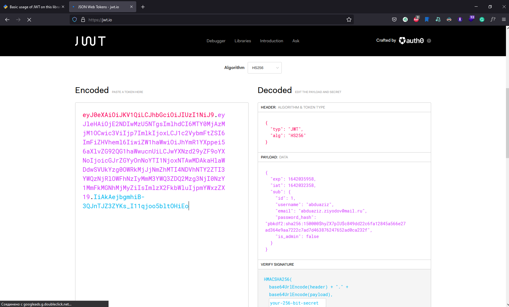

# **Setup Basic JWT Authentication**

### **🧨 Basic application**

Using JWT authentication on this library is very easy! Just one import & definition! For testing it, create a basic flask application with a database (SQLAlchemy is recommended).

We also created one basic route that returns a simple JSON response.

```python hl_lines="7 10-12"
from flask import Flask
from flask_sqlalchemy import SQLAlchemy

app = Flask(__name__)
db = SQLAlchemy(app)

app.config["SQLALCHEMY_DATABASE_URI"] = "sqlite:///database.sqlite"


@app.route("/")
def home():
    return {"message":"It should be protected!"}


if __name__ == "__main__":
    app.run(debug=True) # just run this python code and it will be executed
```

Our task is to protect this route by using JWT tokens. For doing this import `JWT` main class from our `flask_authlib`:

```python
from flask_authlib import JWT
```

Initialize it bypassing your flask app and sqlalchemy `db` as `JWT`'s arguments:

```python
from flask_authlib import JWT

auth = JWT(app,db)
```

!!! tip "Tip"

    If you look at your routes, you will see new API endpoints on your application. They were added by `flask_authlib`'s JWT submodule.

    For getting a list of routes, I recommended using the flask's CLI.

    

    Yeah, you could do it by python code (using `flask. Flask`'s `url_map`). But, I think it is a very simple & good approach for this task.

In this library, `pydantic` is used for the data part (for validating, serializing). Every field of the user's request
the body will be checked & validated!

**✨ Run your development server:**

```bash
$ python server.py
```

or

```bash
$ flask run
```

**Code:**

```python
from flask import Flask
from flask_sqlalchemy import SQLAlchemy


app = Flask(__name__)
db = SQLAlchemy(app)

app.config["SQLALCHEMY_DATABASE_URI"] = "sqlite:///database.sqlite"

auth = JWT(app, db)

@app.route("/")
def home():
    return {"message":"It should be protected!"}

if __name__ == "__main__":
    app.run(debug=True)

```

!!! success "Testing"

    For testing JWT functionality you can any HTTP clients or python's testing frameworks (unittest, pytest ...). But on this tutorial, I prefer to use [postman](https://www.postman.com/) (useful API development tool).

### **🔐 Registration**

- [x] Basic request:
      

- [x] Send empty request body:
      

- [x] Checking email validation:
      

- [x] Successful registration:

  ```python
  {
      email:str # EmailStr on pydantic
      password:str
      username:str
  }
  ```

  

### **🔓 Login**

- [x] Send empty request body:
      

- [x] Checking email validation:
      

- [x] Successful registration:

  ```python
  {
      password:str
      username:str
  }
  ```

  

  🚀 We have got JWT access token!

### **🧮 Decoding**

You can decode this `access_token` on [jwt.io](http://jwt.io)



- [x] After the decoding process, you can easily get the user's credentials without querying to your database!

!!! warning "CORS"

    I recommend to you use `Flask-Cors` before making API requests to your flask server from the frontend(angular,vue, react ...).

    ```bash
    pip install -U flask-cors
    ```

    Basic usage:

    ```python hl_lines="2 5"
    from flask import Flask
    from flask_cors import CORS

    app = Flask(__name__)
    CORS(app)

    @app.route("/")
    def root():
      return {"success":True}
    ```

    > P.S You can also use CORS on your `blueprints`

    [Documentation](https://flask-cors.readthedocs.io/en/latest/index.html)
