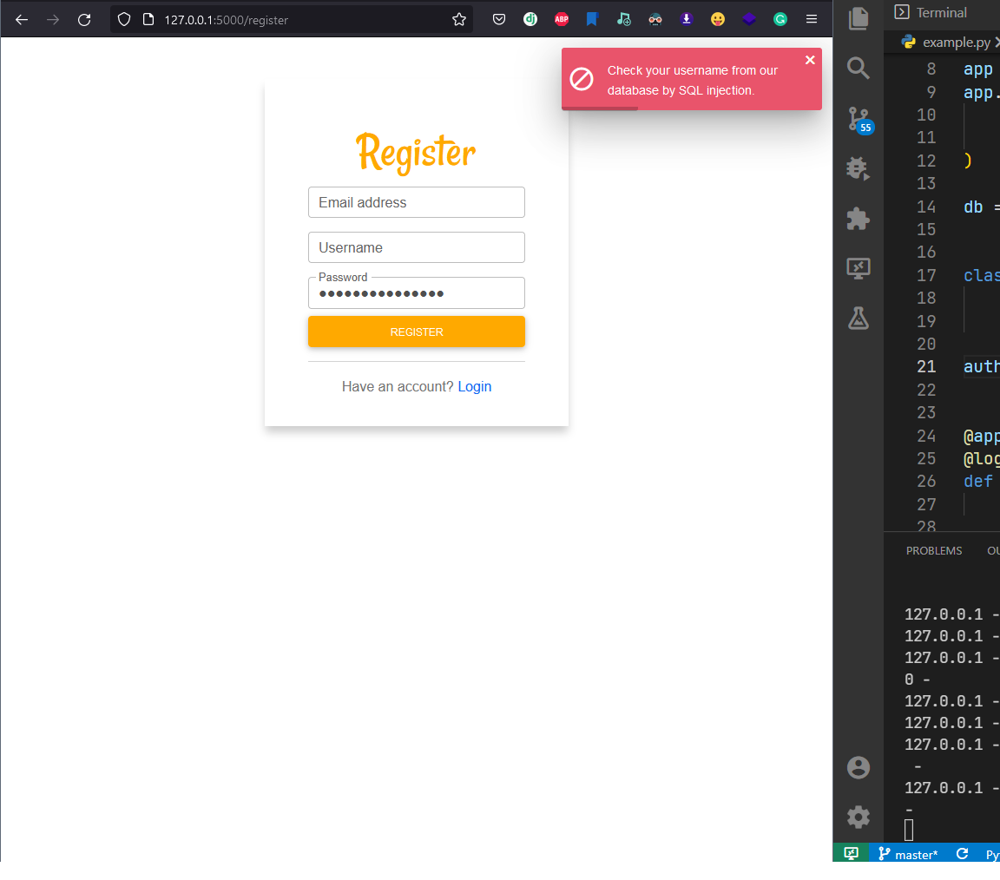

`flask_authlib.Alerts` - a simple configuration that stores alert messages. It is pretty easy that customize alert messages!

An alert object from the source code of this library:

```python
class Alerts:
    EMAIL_ALERT: str = "This email is already taken!"
    USERNAME_ALERT: str = "This username is already taken!"

    REGISTER_SUCCESS: str = "Registration was successful!"

    LOGIN_FAIL: str = "The username or password is incorrect!"

    REGISTER_FAIL: str = "This email and username is already taken!"

    BAD_REQUEST: str = "Bad request!"
    REQUIRED_FIELD: str = "Please, fill in all required fields!"
```

Customizing alerts is very same as `BaseConfig`. Import it, change the values that you want and give your settings object as an argument to `Auth` again!

```python hl_lines="6 17-18 21"
from flask import Flask
from flask_sqlalchemy import SQLAlchemy
from flask_login import login_required

from flask_authlib import AuthManager
from flask_authlib import Alerts

app = Flask(__name__)
app.config.update(
    DEBUG=True,
    SQLALCHEMY_DATABASE_URI="sqlite:///database.db"
)

db = SQLAlchemy(app)


class MyAlerts(Alerts):
    pass


auth = AuthManager(app, db, alerts=MyAlerts)


@app.route("/protected")
@login_required
def protected():
    return "HI, I'M PROTECTED 👋"


if __name__ == "__main__":
    app.run()
```

I want to change the email and username alerts messages:

```python hl_lines="2 3"
class MyAlerts(Alerts):
    EMAIL_ALERT = "if emails.filter(your_email): stop_world()"
    USERNAME_ALERT = "Check your username from our database by SQL injection."
```




Or, you can change `login_fail`'s alert message:

```python hl_lines="2"
class MyAlerts(Alerts):
    LOGIN_FAIL="Get your password from the database and decode it!"
```


🎉