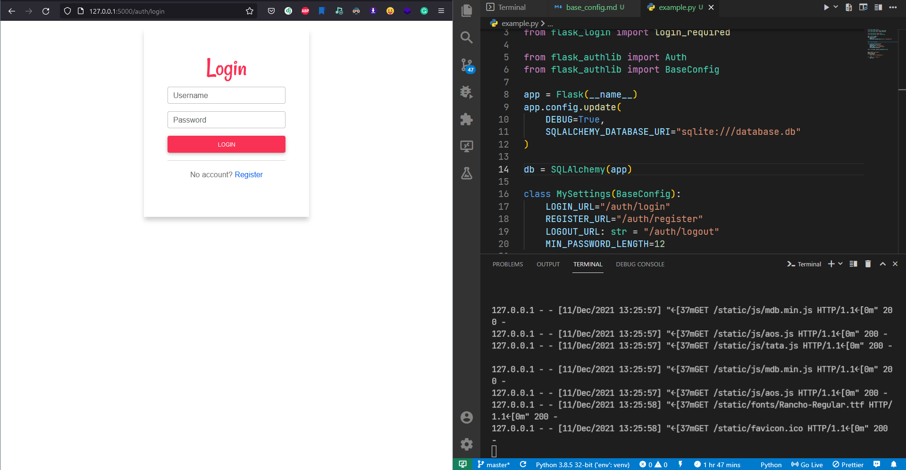

`flask_authlib.BaseConfig` - contains core settings of the library.

Default values of this object:

```python
HOME_URL: str = "/"
LOGIN_URL: str = "/login"
REGISTER_URL: str = "/register"
LOGOUT_URL: str = "/logout"

LOGIN_MESSAGE_CATEGORY = "info"

MIN_PASSWORD_LENGTH: int = 8
EMAIL_UNIQUE: bool = True
```

- `HOME_URL` - home page URL
- `LOGIN_URL` - login page URL
- `REGISTER_URL`: register page URL
- `LOGOUT_URL` - logout URL
- `LOGIN_MESSAGE_CATEGORY` - login message category ( flash message ), it is required by `flask_login`
- `MIN_PASSWORD_LENGTH` - minimum password length, it will be used in registration process.
- `EMAIL_UNIQUE` - if it is `true`, users' email will be validated for uniquennes in the register process.

## Customizing Base Config

Basic Application:

```python
from flask import Flask
from flask_sqlalchemy import SQLAlchemy
from flask_login import login_required
from flask_authlib import Auth

app = Flask(__name__)
app.config.update(
    DEBUG=True,
    SQLALCHEMY_DATABASE_URI="sqlite:///database.db"
)
db = SQLAlchemy(app)

auth = Auth(app, db)


@app.route("/protected")
@login_required
def protected():
    return "HI, I'M PROTECTED 👋"

if __name__ == "__main__":
    app.run()
```

Import `BaseConfig` from `flask_authlib` and create a python class that will describe your custom settings:

```python hl_lines="6 16-17"
from flask import Flask
from flask_sqlalchemy import SQLAlchemy
from flask_login import login_required

from flask_authlib import Auth
from flask_authlib import BaseConfig

app = Flask(__name__)
app.config.update(
    DEBUG=True,
    SQLALCHEMY_DATABASE_URI="sqlite:///database.db"
)

db = SQLAlchemy(app)

class MySettings(BaseConfig):
    pass

auth = Auth(app, db)


@app.route("/protected")
@login_required
def protected():
    return "HI, I'M PROTECTED 👋"

if __name__ == "__main__":
    app.run()
```

!!! warning "Settings"

    There are also some settings that I do not recommend changing: `TEMPLATES_FOLDER_NAME` and others that I have not written above.

Let's customize settings:

```python
class MySettings(BaseConfig):
    LOGIN_URL="/auth/login"
    REGISTER_URL="/auth/register"
    LOGOUT_URL: str = "/auth/logout"
    MIN_PASSWORD_LENGTH=12
```

Now, after customizing we can give our settings object as argument( configs are `Optional` ) to the `Auth` class:

```python hl_lines="7"
class MySettings(BaseConfig):
    LOGIN_URL="/auth/login"
    REGISTER_URL="/auth/register"
    LOGOUT_URL= "/auth/logout"
    MIN_PASSWORD_LENGTH=12

auth = Auth(app, db,base_config=MySettings)
```

- Navigate to `/login`:


- Yeah, we changed login URL and we should navigate `/auth/login`:



- Check register URL:
  

- Check password length:
  

- Check password length validation:
  

- Check register functionality:
  

- Check logout URL after login:
  

!!! info "HTTP 302"

    If we navigate `/auth/logout`, the built-in logout view clears all sessions and will redirect us to `HOME_PAGE`.