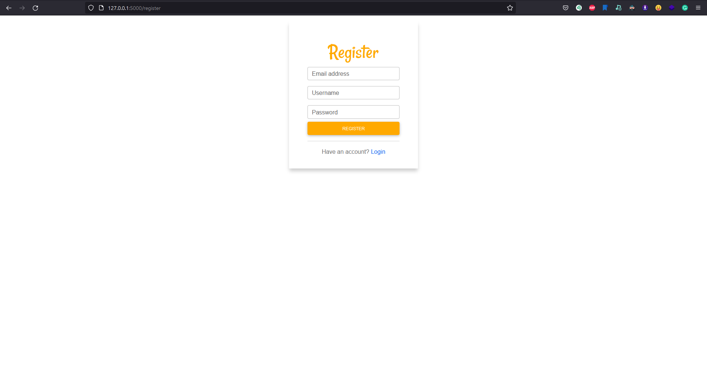

`Flask-Authlib` uses `SQLAlchemy`(sqlalchemy extension for flask) for the database part. After installation this ORM, you should import `AuthManager` and use it like this:

```python hl_lines="3"
from flask import Flask
from flask_sqlalchemy import SQLAlchemy
from flask_authlib import AuthManager
```

Define your `Flask application`, `db` and `AuthManager` base object:

```python hl_lines="5 11"
from flask import Flask
from flask_sqlalchemy import SQLAlchemy
from flask_authlib import AuthManager

app = Flask(__name__)
app.config.update(
    DEBUG=True,
    SQLALCHEMY_DATABASE_URI="sqlite:///database.db"
)

db = SQLAlchemy(app)

auth = AuthManager(app,db)
```

!!! info "`flask_authlib.AuthManager`"

    `AuthManager` takes two arguments(required): `app` (Flask App) and `db` (SQLAlchemy).

Add a simple route and protect it by flask login's `login_required` decorator for testing login functionality:

```python hl_lines="16-17"
from flask import Flask
from flask_sqlalchemy import SQLAlchemy
from flask_login import login_required
from flask_authlib import AuthManager

app = Flask(__name__)
app.config.update(
    DEBUG=True,
    SQLALCHEMY_DATABASE_URI="sqlite:///database.db"
)
db = SQLAlchemy(app)

auth = AuthManager(app, db)


@app.route("/protected")
@login_required
def protected():
    return "HI, I'M PROTECTED 👋"

if __name__ == "__main__":
    app.run()
```

> If we try to navigate `/protected`, it should navigate us to the login page. That is why we used flask_login's `@login_required`.

Next, run your flask application and you will see `magic` things 😂 (navigate to protected route):

* [x] Login Page


* [x] Register Page

Tada 🎉

If we look our application's directory, we can see new folders which are created by `flask_authlib`:

- [x] `static/` - stores static files ( `js`, `css`, `fonts` ... )
- [x] `templates/` - stores `*.html` files
