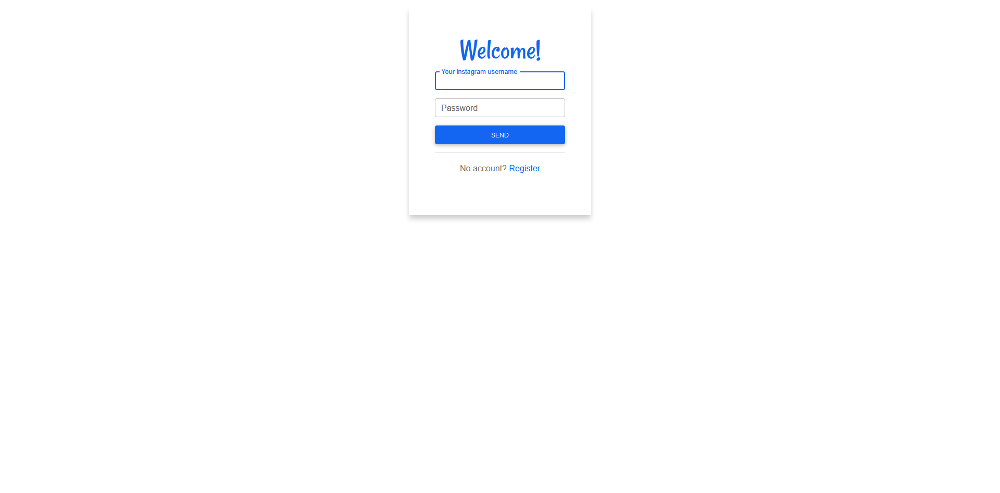
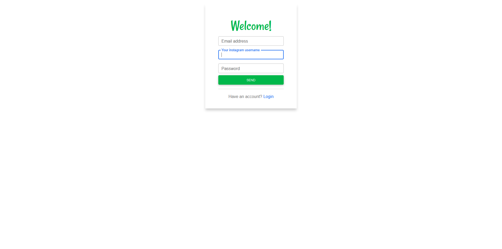

`flask_authlib.TemplateConfig` - pages' labels, titles, buttons' colours are stored in this object.

TemplateConfig object from source code of this library:

```python
class TemplateConfig:
    USERNAME_LABEL: str = "Username"
    PASSWORD_LABEL: str = "Password"
    EMAIL_LABEL: str = "Email address"

    LOGIN_TITLE: str = "Login"
    LOGIN_BTN_TEXT: str = "Login"
    LOGIN_PRIMARY_COLOR: str = "red"

    REGISTER_TITLE: str = "Register"
    REGISTER_BTN_TEXT: str = "Register"
    REGISTER_PRIMARY_COLOR: str = "yellow"
```

Customizing login and register page's title, login page's primary colour and username label's text content:

```python
from flask_authlib import TemplateConfig

class MyTemplateConfig(TemplateConfig):
    USERNAME_LABEL="Your instagram username"
    LOGIN_TITLE="Welcome!"
    REGISTER_TITLE="Welcome!"
    LOGIN_PRIMARY_COLOR="blue"
    REGISTER_PRIMARY_COLOR="green"

    LOGIN_BTN_TEXT: str = "Send"
    REGISTER_BTN_TEXT: str = "Send"
```

- Login Page:
  

- Register Page:
  

!!! info "Primary Color"

    `Primary colour` sets the colour of the button and the title.

    There are List of all **primary colors**:

    * [X] Blue
    * [X] Violet
    * [X] Green
    * [X] Red
    * [X] Yellow
    * [X] White
    * [X] Black